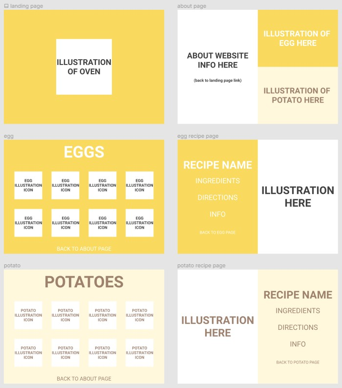

# 🍳 eggs and potatoes 🥔

#### by Jady Hom

[Github](https://github.com/jadyhome) | [LinkedIn](www.linkedin.com/in/jadyhom)

---

### Description

**_eggs and potatoes_** is a front end stack website focusing on my illustrations and varieties of eggs and potatoes recipes.

<!-- Check out my deployed website here → [eggsandpotatoes]() -->

---

### Technologies Used

- HTML5 + CSS3
- JavaScript
- React
- Figma

---

### User Stories

<!-- - Users will see homepage/landing page.
-  -->

---

### Wireframe

Initial Mockup/Wireframe \

---

<!-- ### Screenshots

Final Mockup/Wireframe

Home Page

--- -->

### Future Updates

<!-- - [x]
- [ ] -->

---

### Credits

<!-- [Netlify]() -->
